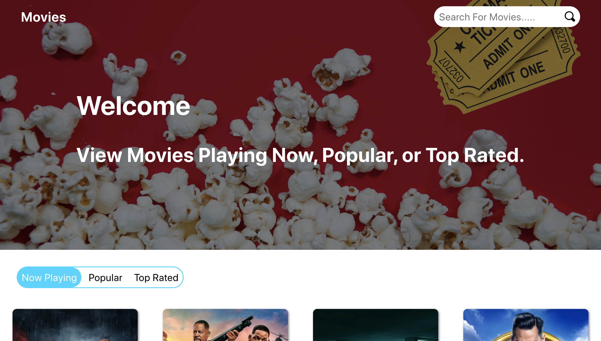

# Movies

## Descriptions:

A take home challenge to Create a Movie application using the TMDB API.

## Preview:




## Getting Started:

These instructions will get a copy of the project up and running on your local machine for usage and testing purposes.

clone down the repository:
```
$ git clone https://github.com/Inzurriaga/CCB-Take-Home.git
```

cd into directory and run npm install:
```
$ npm install
```

launch in your browser:
```
$ npm start
```

## Project Tools:

HTMl\
Javascript\
CSS\
Sass\
React\
Redux\
Redux-Thunk\
React-Router


